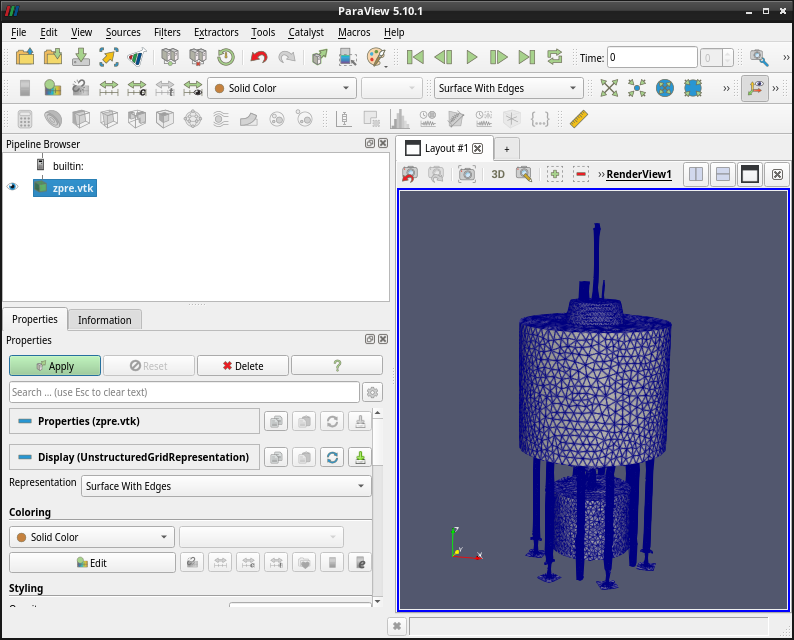
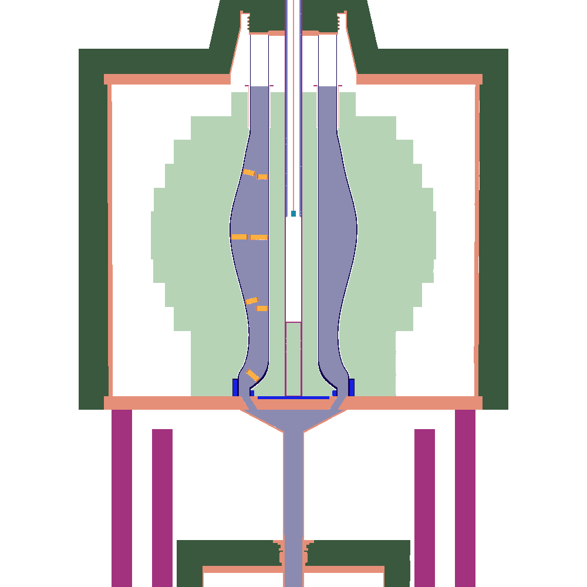
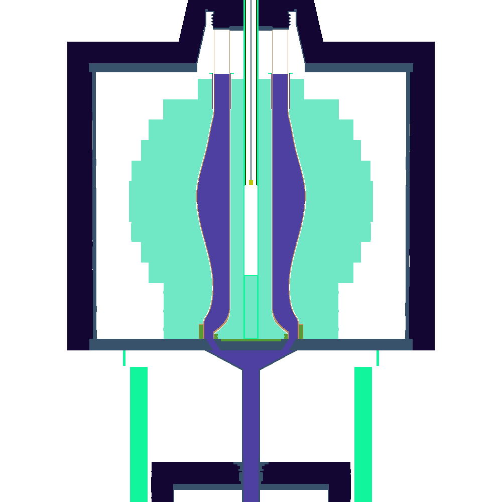

[](https://github.com/openmsr/CAD_to_OpenMC/actions/workflows/python-app.yml)


# CAD_to_OpenMC

This is intended to be a python package heavily inspired by [Paramak](https://github.com/fusion-energy/paramak), and borrows a lot from [step_to_h5m]( https://github.com/fusion-energy/step_to_h5m).
It's "raison d'etre" is to establish an open source-based link between CAD tools in general and the neutron transport code OpenMC.

Although most CAD-tools use some other internal and/or native representation for geometry, most, if not all, will be able to export to the STEP-file format. Therefore this is the format we use

CAD_to_OpenMC uses cadQuery and its links to OCCT to enable import and imprinting/merging algorithms. This is a way of solving the problem with touching surfaces.

The code structure relies on a main class *Assembly*, which maintains the geometry in terms of a list of instances of the subclass Entity.
A geometry is imported from a (set of) .step files into the entity-list. This list is passed on to a mesher-class which generates a meshed geometry.

# To install/set up in a virtual python environment
_replace \<name\> with an arbitrary name for your virtual environment_
1. In the directory where you want your environment to reside do: ```python -m venv <name>```
2. Activate the environment: ```source <name>/bin/activate```
3. Build and install moab (if not already installed). The moab team relies on conda for standard installation but are working on a pip-based solution. Once that is done moab would simply be added to the requirements-file instead.
    1. Clone the moab code-repository: e.g. ```git clone git@bitbucket.org:fathomteam/moab.git```
    2. Configure and build the code:
    ```bash
      mkdir build;
      cd build; cmake .. -DENABLE_PYMOAB=1 -DENABLE_HDF5=1 -DCMAKE_INSTALL_PREFIX=<name>;
      make;
      make install;
    ```
    3. Additionally you will need to build the python interface layer.
    ```bash
      cd pymoab
      sudo python setup.py install
    ```
4. Install the main package: ```pip install CAD_to_OpenMC```. This will pip-install all the required python packages in the virtual environment. This ensures that no additional conflicts are introduced with the system python.

Should you wish to install the development version of this package you may do so by cloning this repository and replace the last command by: ```pip install <path/to/repo>```. This procedure will build and install the python package locally directly from source.

5. Optionally install the msh refinement tool mmg (https://www.mmgtools.org), which may be run in conjunction with the cq/stl-mesher backend to avoid the high aspect ratio triangles that this backend tends to produce. Arch-linux users may install this from the AUR, otherwise get the source (and build from that) or binary builds from the mmg-site.

# Run a test case:
The follwing code-snippet can now be run to explore the capabilities of Assembly/step_to_h5m. We supply a couple of example .step-files in the examples directory. In this example we'll be using a geometry with a set of 7 pin-cells.

```python
  import CAD_to_OpenMC.assembly as ab
  a=ab.Assembly()
  a.stp_files=["examples/7pin.step"]
  a.import_stp_files()
  a.solids_to_h5m()
```
as of version 0.2.6 a simpler version of this test-script may be used as we have added a small set of convenience functions. One possibility is:
```python
  import CAD_to_OpenMC.assembly as ab
  a=ab.Assembly(['examples/7pin.step'])
  a.run()
```
which will read the 7pin.step example file and output a file by the default name dagmc.h5m

Unless anything else is specified this procedure simply uses the default CAD_to_OpenMC parameters to create meshes using the default choice of meshing backend - namely gmsh.
E.g. for the "gmsh"-backend this means sampling curves 20 times, a minimum mesh-element size of 0.1, and a maximum mesh element size of 10.
This procedure will in turn call OCP and gmsh to produce a mesh with merged surfaces in the output file "dagmc.h5m"

The other available meshing backends are based on stl-export from CadQuery (accessible by setting ```backend='stl'```, or ```backend='stl2'```) which uses the parameters ```tolerance``` and ```angular_tolerance``` to set meshing quality.
E.g. choosing the 'stl2' backend would alter the call to run to:
```python
  a.run(backend='stl2')
```
Similarly the output filename may be set using the parameter h5m_filename.

Meshing parameters are changed by means of altering entries in the ```mesher_config```-dictionary defined  in the assembly module root namespace. Like:
```python
 ab.mesher_config['min_mesh_size']=0.2
 ```

Below is a list of the available parameters and their
meanings:

<dl>
    <dt>min_mesh_size</dt>
        <dd>Minimum mesh element size (gmsh backend/mmg_refinement)</dd>
    <dt>max_mesh_size</dt>
        <dd>Maximum mesh element size (gmsh backend/mmg_refinement)</dd>
    <dt>curve_samples</dt>
        <dd>The number of point samples used to approximate a curve, 1D-mesh. (gmsh backend)</dd>
    <dt>mesh_algorithm</dt>
        <dd>Integer specifying which meshing algorithm to use (gmsh backend) 1: Adaptive algorithm - most often the most robust choice.</dd>
    <dt>vetoed</dt>
        <dd>A list of surfaces that should be excluded from meshing. Useful when some surface fails for whatever reason. Be aware that this may make your geometry non-watertight.</dd>
    <dt>threads</dt>
        <dd>The number of threads to be used to speed up the meshing algorithms. Useful for multicore-computers.</dd>
    <dt>tolerance</dt>
        <ddRelative mesh tolerance (stl/stl2 backends). Lower this to get a finer mesh.</dd>
    <dt>angular_tolerance</dt>
        <dd>Relative angular mesh tolerance (stl/stl2 backends) Lower this to get a better angular resolution.</dd>
    <dt>refine</dt>
        <dd>After the initial meshing step is done, should the mesh be refined?

This option has more than one meaning depending on which backend you have chosen.
- If the cq/stl-backend is active and the *refine* option is non-zero or True, the mesh-refinment tool (mmg)[https://www.mmgtools.org] is called in sequence on each surface.
- If the gmsh-backend is active and the *refine* option is non-zero the gmsh-refinement tool is called on the full geometry the given number of times. A value of True is the same as setting the option to 1, i.e. it triggers a single loop through the refinement algorithm.</dd>
   <dt>verbose</dt>
      <dd>Output lots of information from the mesher backends.</dd>
</dl>

## meshing backends
At present three different backends exist for CAD_to_OpenMC: 'gmsh', 'stl', 'stl2'. It is possible to add another backend should another meshing library become available.

### gmsh
The inner workings of this backend is basically a simple call to gmsh to create a 2D-mesh of the entire geometry. This has the advantage that inhenrently boundary curves are meshed only once, meaning that in theory, they can be made to account for shared surfaces without unwanted artefacts. At its present stage however there may be problems with leakage when performing transport calculation on geometries with shared surfaces. A significant drawback todoing the entire geometry all at once, is that for larger geometries memory requirements may be prohibitive.

### stl
The stl backend takes a different approach. Instead each solid object in a step geometry is triangulated on its own. The triangulation itself is performed by calls to the underlying OpenCASCADE-library through the python layer cadquery. This procedure sidesteps the problem with large geometries, as each object in handled on its own. Objects cannot overlap however, and just as the case is for the gmsh-backend, surfaces should not be coincident.

### stl2
As its name implies the stl2 backend builds on concepts from the stl backend. However a major difference lies in the fact that objects can now have coincident surfaces. This is achieved by splitting the tringulation operation further and instead perform it in a face-by-face manner. This way we may skip the operation is one face (or surface) is a part of two solids. Furthermore, when the surfaces are assembled into a h5m datafile, the surfaces may be appropriately flagged such that transport algorithms can handle moving from one to another. If this is important for your problem, then this is the backend you should use.

## implicit complement
CAD_to_OpenMC supports the notion of an implicit complement material, i.e. a material that fills all the space within the geometry which has _not_ been claimed by any part in the CAD-assembly. For instance if one wanted to submerge a pincell in in water it is possible to only define the pincell as part and set the implicit complement material to water. To do so we would use code like:
```python
import CAD_to_OpenMC.assembly as ab
a=ab.Assembly()
a.implicit_complement='water'
...
```
Of course, this means that the subsequent OpenMC transport simulation needs to define a material (with the wanted properties) named 'water'.

## Intermediate datafiles
In the process of generating an .h5m-geometry file CAD_to_OpenMC also generates a sometimes large amount of intermediary datafiles, these may be retained for debugging purposes (default), but by setting a flag CAD_to_OpenMC can be directed to delete them automatically once they're no longer needed.
```python
import CAD_to_OpenMC.assembly as ab
a=ab.Assembly()
a.delete_intermediate=True
```

# Advanced example
For a more advanced example of the use of CAD_to_OpenMC and OpenMC we may turn to the Zero Power Reactor Experiment. This was a full-scale reactor experiment that was carried out at Oak Rodge TN in the 1960's. Copenhagen Atomics provides a CAD-drawn model of this experiment, extracted from the original reports and drawings from the original experiment, in the form of a step-file. To get access simply clone the zpre github repository and run the scripts:
```bash
git clone https://www.github.com/openmsr/zpre
cd zpre
bash run.sh
```
The ```run.sh```-script will the ask you what kind of calculation you'd like to perform. As a first run you might choose to ask OpenMC to simply plot the geometry of the reactor (option 2). If this is the first time you run the script, this triggers a surface-meshing operation to be performed (Be aware that by default this creates a large amount of console output - this is to be expected).
During the surface meshing operation (by default) a .vtk-file is created in addition to the .h5m-file that OpenMC (and DAGMC) needs. This is for convenience so you may inspect the created mesh using e.g. paraview, if you have access to that.
If you have paraview installed the call ```paraview h5m_files/zpre.vtk``` should yield a geometry like this .

Once this process has finished, there should now be a file zpre.h5m inside the h5m_files directory, and a set of plot_[123].png files. which correspond to XY,XZ, and YZ-slices through the center of the reactor.
If all goes well these should look something like this:

|XY|XZ|XZ|
|:--:|:--:|:--:|
|  |  |  |

The colors are chosen arbitrarily amd automatically by the OpenMC-plotting routine, which is why the same geomtrical entity gets a different color in the slices.
